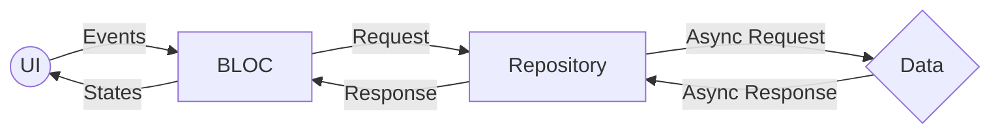
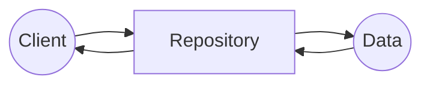

# Flutter      
 ## What is Flutter?      
 Flutter is Google’s portable UI toolkit for crafting beautiful, natively compiled applications for mobile, web, and desktop from a single codebase. Flutter works with existing code, is used by developers and organizations around the world, and is free and open source.    

## Requirements
minimum requirements for this blueprint:

 - Flutter version 3.0.2
 - Dart version 2.17.3
 - DevTools version 2.12.2
 - Android SDK version 30.0.3

> requirements can change at any time
    
# DIO 
DIO is a networking library developed by Flutter China. It is powerful Http client for Dart, which supports Interceptors, Global configuration, FormData, Request Cancellation, File downloading, ConnectionTimeout etc. Things that dio supports can be done with normal http library which we get in flutter sdk too but its not that easy to learn or understand so dio can be better.    
    
## How to install DIO? 
So lets get started with Dio. To get started with Dio first of all you need to add [**dependency**](https://pub.dev/packages/dio#-installing-tab-) **:** 
```yaml    
    dependencies:    
    dio: ^5.0.2    
```    
    
Then install the package using the command line in your terminal and import it :    
For installing the package :    
```shell
$ flutter pub get    
```    
    
Now in your dart code use :    
```dart    
    import 'package:dio/dio.dart';    
```    
    
## Service for Rest API
It is worth mentioning that the request initiated by HttpClient is still used internally by dio, so the proxy, request authentication, certificate verification, etc. are the same as HttpClient, and we can `onHttpClientCreate`set it in the callback.  
```dart    
    
    class Client {      
      // Dio service that doesn't use token      
      static Future<Dio> init() async {      
        Dio _dio = new Dio();      
          
        (_dio.httpClientAdapter as DefaultHttpClientAdapter).onHttpClientCreate =      
            (HttpClient client) {      
          client.badCertificateCallback =      
              (X509Certificate cert, String host, int port) => true;      
          return client;      
        };      
          
        _dio.options.baseUrl = AppSettings.apiBaseUrl + ":" + AppSettings.apiPort;      
        _dio.options.headers['Accept'] = 'application/json';      
        _dio.options.headers['Content-Type'] = 'application/json';      
        _dio.interceptors.add(      
          PrettyDioLogger(      
            requestHeader: true,      
            requestBody: true,      
            responseBody: true,      
            responseHeader: true,      
            error: true,      
            compact: true,      
          ),      
        );      
        return _dio;      
      }      
          
      // Dio service that uses token      
      static Future<Dio> initWithToken

      (

      baseUrl: AppSettings.apiBaseUrl, port: AppSettings.apiPort, isPort: AppSettings.isUsePort) async {
      Dio _dio = new Dio();      
        (_dio.httpClientAdapter as DefaultHttpClientAdapter).onHttpClientCreate =      
            (HttpClient client) {      
          client.badCertificateCallback =      
              (X509Certificate cert, String host, int port) => true;      
          return client;      
        };      
          
        String token = await SecureStorageService.getApiToken();      
          
        _dio.options.baseUrl = AppSettings.apiBaseUrl + ":" + AppSettings.apiPort;      
        _dio.options.headers['Accept'] = 'application/json';      
        _dio.options.headers['Content-Type'] = 'application/json';      
        _dio.options.headers['token'] = token;      
        _dio.interceptors.add(      
          PrettyDioLogger(      
            requestHeader: true,      
            requestBody: true,      
            responseBody: true,      
            responseHeader: true,      
            error: true,      
            compact: true,      
          ),      
        );      
        return _dio;      
      }      
    }    
 ```  
 Note that it `onHttpClientCreate`will be called when the HttpClient needs to be created inside the current dio instance, so configuring HttpClient through this callback will take effect on the entire dio instance. If you want to request a separate proxy or certificate verification policy for an application, you can create a new dio instance.  
  
### **Now performing a GET request**  
Here first of all use a Dio instance then await the response you want to get.  
```dart  
Response response = await _client.get(    
     param,    
     options: Options(    
        followRedirects: false,    
        validateStatus: (status) {    
           return true;    
       },   
     ),  
  );   
```  
  
### **Performing a POST request**  
After getting the request using Dio instance await the request you want to post.  
```dart  
Response response = await _client.post(    
   param,    
   options: Options(    
      followRedirects: false,    
      validateStatus: (status) {    
         return true;    
      },   
   ),   
   data: loginRequestToJson(request),    
);  
```  

### Performing a DELETE request

 Using Dio instance await the request you want to post.
```dart  
Response response = await _client.delete(    
   param,    
   options: Options(    
      followRedirects: false,    
      validateStatus: (status) {    
         return true;    
      },   
   ),   
   data: dataRequestToJson(request),    
);  
```  
  
### **Get response with bytes**  
To get response in byte you need to set responseType to ‘bytes’ .  
```dart  
Response response = await _client.post(    
   param,    
   options: Options(    
      responseType: ResponseType.bytes,  
      followRedirects: false,    
      validateStatus: (status) {    
         return true;    
      },   
   ),   
   data: loginRequestToJson(request),    
);  
```  
  
### **Sending FormData**  
To send the FormData use the instance FormData from the map and specify where you want to send the data and await the post.  
```dart  
String fileName = file.path.split('/').last;    
FormData formData = FormData.fromMap({    
  "files":    
  await MultipartFile.fromFile(file.path, filename: fileName),    
});  
Response response = await _client.put(  
      param,  
      options: Options(  
        followRedirects: false,  
        validateStatus: (status) {  
          return true;  
        },  
      ),  
      data: formData,  
    );  
```  
  
### **Uploading multiple files to server by FormData**  
For the time where you need to upload multiple files to server by your formData at that time using MultiPartFile then awaiting it step by step and vice versa can reduce your valuable time.  
```dart  
FormData.fromMap({    
"name": "imhsa",    
"age": 22,    
"file": **await** MultipartFile.fromFile("./text.txt",filename: "upload.txt"),    
"files": [    
**await** MultipartFile.fromFile("./text1.txt", filename: "text1.txt"),    
**await** MultipartFile.fromFile("./text2.txt", filename: "text2.txt"),    
]    
});    
response = **await** dio.post("/info", data: formData);  
```  
  
### **Performing multiple concurrent requests**  
Lots of time occurs when you need to call different API in the same instance of time which tends to get confusing some times at that time dio can be used easily to get the responses from different API’s.  
```dart  
response = **await** Future.wait([dio.post("/info"), dio.**get**("/token")]);  
```  
  
### **For Downloading a file**  
For downloading any sorts of file Dio can be a best decision. It can be done using normal http library which we get in flutter sdk too but its not that easy to learn or understand so dio can be used.  
```dart  
response = await dio.download("https://www.google.com/", "./xx.html","./xx.jpeg","./xx.pdf");  
```  
  
### **Get response stream**  
A Stream provides a way to receive a sequence of events. So to get response stream with the flow of your code you need to set responseType to ‘stream’ .  
```dart  
Response<ResponseBody> rs = await Dio().get<ResponseBody>(url,    
options: Options(responseType: ResponseType.stream),    
// set responseType to `stream`    
);    
print(rs.data.stream); //response stream  
```  
  
### **Listening the uploading progress**  
To listen the uploading progress of the response after using await in the post request the function onSendProgress can be useful.  
```dart  
response = **await** dio.post(    
"http://www.dtworkroom.com/doris/1/2.0.0/test",    
data: {"aa": "bb" * 22},    
onSendProgress: (int sent, int total) {    
print("$sent $total");    
},    
);  
```  
  
### **Post binary data by Stream**  
```dart  
_// Binary data_    
List<int> postData = <int>[...];    
**await** dio.post(    
url,    
data: Stream.fromIterable(postData.map((e) => [e])),    
_//create a Stream<List<int>>_    
options: Options(    
headers: {    
Headers.contentLengthHeader: postData.length,    
_// set content-length_    
},    
),    
);  
```  
  
**baseUrl**: It request the base url which normally contains the sub path. Like  `_"https://www.google.com/api/"._`  
  
**connectionTimeout** : It contains the timeout in milliseconds for opening url.  
  
**receiveTimeout :** Whenever the time between two events from response stream is greater then receiveTimeout then the Dio will throw the DioError with  `_DioErrorType.RECEIVE_TIMEOUT_`  
```dart  
dio.options.baseUrl = "https://www.xx.com/api";    
dio.options.connectTimeout = 5000; _//5s_    
dio.options.receiveTimeout = 3000;BaseOptions options = **new** BaseOptions(    
    baseUrl: "https://www.xx.com/api",    
    connectTimeout: 5000,    
    receiveTimeout: 3000,    
);    
Dio dio = **new** Dio(options);  
```  
[Reference DIO from Ashmi kattel](https://medium.com/@ashmikattel/dio-in-flutter-ad6ba26aee36#:~:text=Talking%20about%20dio%20,%20It%20is,,%20File%20downloading,%20ConnectionTimeout%20etc.)  
    
# BLOC Pattern      
 Bloc is a design pattern created by Google to help separate business logic from the presentation layer and enable a developer to reuse code more efficiently      
      

## How to install BLOC Pattern
there are several libraries that must be installed
```yaml
flutter_bloc: ^9.0.0
equatable: ^2.0.3  
provider: ^6.0.3
```

### Install BLOC
Depend on it

Run this command:

With Flutter:
```shell
$ flutter pub add flutter_bloc
```
This will add a line like this to your package's pubspec.yaml (and run an implicit `flutter pub get`):
```yaml
dependencies:
  flutter_bloc: ^9.0.0 #Minimum requirement flutter_bloc version 9.0.0
```
Alternatively, your editor might support `flutter pub get`. Check the docs for your editor to learn more.

Import it

Now in your Dart code, you can use:
```dart
import 'package:flutter_bloc/flutter_bloc.dart';
```
### Install Equatable
Depend on it

Run this command:

With Dart:
```shell
$ dart pub add equatable
```
With Flutter:
```shell
$ flutter pub add equatable
```
This will add a line like this to your package's pubspec.yaml (and run an implicit `dart pub get`):
```yaml
dependencies:
  equatable: ^2.0.3
```
Alternatively, your editor might support `dart pub get` or `flutter pub get`. Check the docs for your editor to learn more.

Import it

Now in your Dart code, you can use:
```dart
import 'package:equatable/equatable.dart';
```

### Install Provider
Depend on it

Run this command:

With Flutter:
```shell
$ flutter pub add provider
```
This will add a line like this to your package's pubspec.yaml (and run an implicit `flutter pub get`):
```yaml
dependencies:
  provider: ^6.0.3
```
Alternatively, your editor might support  `flutter pub get`. Check the docs for your editor to learn more.

Import it

Now in your Dart code, you can use:
```dart
import 'package:provider/provider.dart';
```

# Flutter BLOC Concepts    
 There are 6 concepts for using bloc including:      
      
 1. Repository    
 2. States    
 3. Events    
 4. Bloc    
 5. BlocProvider    
 6. BlocBuilder    
    
## Repository
The repository pattern is a software design pattern that decouples the data access logic from the business logic by introducing a centralized component called a repository

As you can see in the above diagram, the generic repository pattern consists of three inter-connected components:
1.  Client — refers to a component that initiates the data request, like a controller or service
2.  Repository — provides data in a domain-friendly format via a specific API, and doesn’t let clients directly access data from the source
3.  Data source — provides data records according to a data-layer-specific format; the data source can be a RESTful API, SQLite connection, or MongoDB connection
```dart
abstract class ProfileRepository {  
  Future<ProfileResponse> profile();
}

class ProfileService implements ProfileRepository {
	@override  
	Future<ProfileResponse> profile() async {
      final Dio _client = await Client.initWithToken(baseUrl: AppSettings.apiBaseUrl,
          port: AppSettings.apiPort,
          isPort: AppSettings.isUsePort);

      String param = ApiEndpoint.profile;  
	  
	  Response response = await _client.get(  
	  param,  
	  options: Options(  
	  followRedirects: false,  
	  validateStatus: (status) {  
	  return true;  
	 }, ) );  
	  ProfileResponse data = profileResponseFromJson(response.toString());  
	  return data;  
	}
}
```

## States
```dart
abstract class LoginState extends Equatable {  
  @override  
  List<Object> get props => [];  
}  
  
class LoginInitState extends LoginState {}  
  
class LoginIdleState extends LoginState {  
  LoginIdleState();  
}  
  
class LoginLoading extends LoginState {}  
  
class LoginLoaded extends LoginState {  
  final ProfileResponse response;  
  
  LoginLoaded({required this.response});  
}  
  
class LoginError extends LoginState {  
  final textError;  
  
  LoginError({this.textError});  
}
```

## Events
```dart
abstract class LoginEvent extends Equatable {  
  const LoginEvent();  
  
  @override  
  List<Object> get props => [];  
}  
  
class LoginIdleEvent extends LoginEvent {  
  const LoginIdleEvent();  
}  
  
class LoginFetched extends LoginEvent {  
  const LoginFetched({required this.request});  
  
  final LoginRequest request;  
  
  @override  
  List<Object> get props => [];  
}
```

## Bloc
```dart
class LoginBloc extends Bloc<LoginEvent, LoginState> {  
  final AuthRepository authRepository;  
  
  LoginBloc({required this.authRepository}) : super(LoginInitState()) {  
  on<LoginEvent>((event, emit) async {  
  if (event is LoginIdleEvent) {  
  emit(LoginIdleState());  
 } else if (event is LoginFetched) {  
  emit(LoginLoading());  
  try {  
  ProfileResponse response = await authRepository.login(event.request);  
  
  if (response.message!.toLowerCase() == "success")  
  emit(LoginLoaded(response: response));  
  else  
  emit(LoginError(textError: response.message));  
 } on SocketException {  
  emit(LoginError(textError: "Tidak ada koneksi internet"));  
 } on HttpException {  
  emit(LoginError(textError: "Service tidak ditemukan"));  
 } on FormatException {  
  emit(LoginError(  
  textError: "Terjadi kesalahan, mohon coba beberapa saat lagi."));  
 } catch (e) {  
  emit(LoginError(  
  textError:  
  "Terjadi masalah dalam jaringan. Mohon tunggu beberapa saat lagi."));  
 } } }); }}
 ```

 ## BlocProvider    
 BlocProvider is a flutter widget that creates and provides a Bloc to all of its children. This is known as a dependency injection widget, so that a single instance of Bloc can be provided to multiple widgets within a subtree. In other words, the entire subtree will benefit from a single event of a Bloc injected into it. Hence the subtree will be dependent on the Bloc we're providing.    
```dart    
@override      
Widget build(BuildContext context) {      
  return MultiBlocProvider(      
     providers: [    
        BlocProvider<LoginBloc>(     
        create: (BuildContext context) => LoginBloc(      
              authRepository: AuthService()),     
        ),     
     ],     
     child: LoginBody(),      
 );    
}    
```    
    
## BlocBuilder 
BlocBuilder is a widget that helps rebuild the UI based on some Bloc state changes. This magic component rebuilds the UI every time either Bloc emits a new state.    
    
Rebuilding a large chunk of the UI inside your app may take a lot of time to compute. That's why it's a good practice to wrap the exact part of the UI you want to rebuild inside BlocBuilder. For example, if you have a text widget that updates from a sequence of emitted states and that text is inside columns, rows, and other widgets, it is a colossal mistake to rebuild all of them to update the text widget. Instead, it would be best if you rebuilt only the text widget by wrapping it inside BlocBuilder.    
    
Syntactically, BlocBuilder is a widget that requires a Bloc and the builder function. The builder function will potentially be called many times as the Flutter engine works behind the scenes and should be a pure function that returns a widget in response to a state. A pure function is when the return value depends only on the function's arguments. So, in this case, our builder function should return a widget which only depends on the context and state parameters.    
    
```dart    
BlocBuilder<LoginBloc, LoginState>(    
  builder: (context, state) {    
    bool _isLoading = false;    
    if (state is LoginLoading) {    
      _isLoading = true;    
    }    
    
    if (state is LoginLoaded) {    
      _isLoading = true;    
      Helpers.onWidgetDidBuild(() {    
        _navigationLoginPage();    
      });    
      context.read<LoginBloc>().add(LoginIdleEvent());    
    }    
    
    if (state is LoginError) {    
      _isLoading = false;    
      Helpers.onWidgetDidBuild(() {    
        ScaffoldMessenger.of(context).showSnackBar(    
          SnackBar(content: Text(state.textError)),    
        );    
      });    
      context.read<LoginBloc>().add(LoginIdleEvent());    
    }    
    
    return Column(    
      children: [    
        Loading(    
          isShow: _isLoading,    
          color: AppColors.green_339933,    
        ),    
        Visibility(    
          visible: !_isLoading,    
          child: EdgeButton(    
            text: "Login",    
            onPressed: !_buttonMasuk    
                ? null    
                : () {    
                    _loadLogin();    
                  },    
            isFullWidth: true,    
            buttonColor: AppColors.green_339933,    
            textColor: Colors.white,    
          ),    
        ),    
      ],    
    );    
  },    
)    
```    
      
the way to call BlocBuilder is    
```dart    
LoginBloc? loginBloc;    
    
@override    
void initState() {    
  super.initState();    
  loginBloc = context.read<LoginBloc>(); // Initialization BLOC    
    
  loginRequest.email = _emailController.text.toString();    
  loginRequest.password = _passwordController.text.toString();    
  loginBloc!.add(LoginFetched(request: loginRequest)); // Fetching BLOC    
}    
```    

# Routing
screen switching from one screen to another

## The Routing Constant
```dart
// Splash  
const String splashRoute = "/";
// Menu  
const String menuRoute = "/menu";
const String menuDetailRoute = "/menu/menu-detail";
```

## Router Generator
```dart
class RouterGenerator {  
  static Route<dynamic> generateRoute(RouteSettings settings) {  
  switch (settings.name) {  
  case splashRoute:  
	final screen = SplashScreen();  
	return MaterialPageRoute(builder: (_) => screen);   
  
  case mainRoute:  
	 final screen = MainScreen(  
		currentIndex: settings.arguments as int,  
	 );  
	 return MaterialPageRoute(  
		  settings: RouteSettings(  
			  name: 'Home Screen',  
			 ),  
			 builder: (_) => screen);  
  
  default:  
	  return MaterialPageRoute(  
		  builder: (_) => Scaffold(  
			  body: Center(  
				  child: Text('No route defined for ${settings.name}'),  
					 ), 
				 ), 
			 );
		  } 
	 }
 }
 ```
# Constant Variable
variable that can be used many times
## API Path
contains all the API endpoints
```dart
class ApiEndpoint {  
  /// Auth  
  static String authToken = "/token/auth";  
  
  // Profile  
  static String profile = "/user-handheld/profile";  
}
```

## App Constant
contains all the application constants
```dart
class AppConstant {  
  /// Font  
  static final String font = "Sora";  
  
  /// Local Storage Service  
  static final String isLogin = "is_login";  
  static final String profileData = "profile_data";  
  
  /// Secure Storage Service  
  static final String apiToken = "api_token";  
  static final String refreshApiToken = "refresh_api_token";  
  static final String fcmToken = "fcm_token";  
}
```

## Assets Path
contains all the assets path such as Images
```dart
class Assets {  
  // SVG format  
  static final String logo = "assets/images/ic_logo.svg";
  
  // PNG format  
  static final String noImage = "assets/images/no_image.png";   
}
```

## App Settings
contains all the .env
```dart
class Settings {  
  static const appName = "appName";  
  static const apiBaseUrl = "apiBaseUrl";  
  static const apiPort = "apiPort";  
}  
  
class EnvConst {  
  static const appNameDevelopment = "APP_NAME_DEVELOPMENT";  
  static const apiBaseUrlDevelopment = "API_BASE_URL_DEVELOPMENT";  
  static const apiPortDevelopment = "API_PORT_DEVELOPMENT";   
  
  static const appNameStaging = "APP_NAME_STAGING";  
  static const apiBaseUrlStaging = "API_BASE_URL_STAGING";  
  static const apiPortStaging = "API_PORT_STAGING";  
  
  static const appNameProduction = "APP_NAME_PRODUCTION";  
  static const apiBaseUrlProduction = "API_BASE_URL_PRODUCTION";  
  static const apiPortProduction = "API_PORT_PRODUCTION";   
}  
  
enum AppFlavor {  
  development,  
  staging,  
  production,  
}  
  
class AppSettings {  
  static late AppFlavor flavor;  
  
  static String get appName => flavor.getSetting(Settings.appName);  
  
  static String get apiBaseUrl => flavor.getSetting(Settings.apiBaseUrl);  
  
  static String get apiPort => flavor.getSetting(Settings.apiPort);  
}  
  
extension AppFlavorExtension on AppFlavor {  
  static final Map<String, dynamic> developmentSettings = {  
  Settings.appName: dotenv.env[EnvConst.appNameDevelopment],  
  Settings.apiBaseUrl: dotenv.env[EnvConst.apiBaseUrlDevelopment],  
  Settings.apiPort: dotenv.env[EnvConst.apiPortDevelopment],  
 };  
  static final Map<String, dynamic> stagingSettings = {  
  Settings.appName: dotenv.env[EnvConst.appNameStaging],  
  Settings.apiBaseUrl: dotenv.env[EnvConst.apiBaseUrlStaging],  
  Settings.apiPort: dotenv.env[EnvConst.apiPortStaging],  
 };  
  static final Map<String, dynamic> productionSettings = {  
  Settings.appName: dotenv.env[EnvConst.appNameProduction],  
  Settings.apiBaseUrl: dotenv.env[EnvConst.apiBaseUrlProduction],  
  Settings.apiPort: dotenv.env[EnvConst.apiPortProduction],  
 };  
  dynamic getSetting(String setting) {  
  switch (this) {  
  case AppFlavor.development:  
  return developmentSettings[setting];  
  case AppFlavor.staging:  
  return stagingSettings[setting];  
  case AppFlavor.production:  
  return productionSettings[setting];  
  default:  
  throw "Unknown Flavor";  
 } }}
 ```

# Themes
theme used to change dark mode, light mode and color

## App Colors
```dart
// All custom colors generate  
class AppColors {  
  static const primary = grey_8A8A8E;  
  static const secondary = grey_8A8A8E;  
  static const accent = grey_8A8A8E;  
  
  static const grey_8A8A8E = Color(0xFF303436);  
}
```

## Theme Manager
function used to change dark mode or light mode
```dart
class AppThemeNotifier extends ChangeNotifier {  
  // Setup dark mode  
  final darkTheme = ThemeData.dark().copyWith(  
  primaryColor: AppColors.black_272727,  
  backgroundColor: AppColors.black_272727,  
  indicatorColor: AppColors.grey_ADBBD8,  
  focusColor: Colors.white,  
  disabledColor: AppColors.black_272727,  
  cardColor: AppColors.black_1C1C1C,  
  canvasColor: AppColors.grey_E4E4E6,  
  bottomNavigationBarTheme: BottomNavigationBarThemeData(  
  backgroundColor: AppColors.black_1C1C1C,  
 ),  bottomAppBarTheme: BottomAppBarTheme(color: AppColors.black_1C1C1C),  
  textTheme: TextTheme(  
  headline1: TextStyle(fontFamily: AppConstant.font),  
  headline2: TextStyle(fontFamily: AppConstant.font),  
  headline3: TextStyle(fontFamily: AppConstant.font),  
  headline4: TextStyle(fontFamily: AppConstant.font),  
  headline5: TextStyle(fontFamily: AppConstant.font),  
  headline6: TextStyle(fontFamily: AppConstant.font),  
  bodyText1: TextStyle(fontFamily: AppConstant.font),  
  bodyText2: TextStyle(fontFamily: AppConstant.font),  
  subtitle1: TextStyle(fontFamily: AppConstant.font),  
  subtitle2: TextStyle(fontFamily: AppConstant.font),  
 ), );  
  // Setup light mode  
  final lightTheme = ThemeData.light().copyWith(  
  primaryColor: AppColors.white_E5E5E5,  
  backgroundColor: AppColors.white_E5E5E5,  
  indicatorColor: AppColors.black_1C1C1C,  
  focusColor: AppColors.black_1C1C1C,  
  disabledColor: AppColors.grey_ADBBD8,  
  cardColor: Colors.white,  
  canvasColor: AppColors.grey_494949,  
  bottomNavigationBarTheme: BottomNavigationBarThemeData(  
  backgroundColor: Colors.white,  
 ),  bottomAppBarTheme: BottomAppBarTheme(color: Colors.white),  
  textTheme: TextTheme(  
  headline1: TextStyle(fontFamily: AppConstant.font),  
  headline2: TextStyle(fontFamily: AppConstant.font),  
  headline3: TextStyle(fontFamily: AppConstant.font),  
  headline4: TextStyle(fontFamily: AppConstant.font),  
  headline5: TextStyle(fontFamily: AppConstant.font),  
  headline6: TextStyle(fontFamily: AppConstant.font),  
  bodyText1: TextStyle(fontFamily: AppConstant.font),  
  bodyText2: TextStyle(fontFamily: AppConstant.font),  
  subtitle1: TextStyle(fontFamily: AppConstant.font),  
  subtitle2: TextStyle(fontFamily: AppConstant.font),  
 ), );  
  // get theme mode  
  late ThemeData _themeData;  
  
  ThemeData getTheme() => _themeData;  
  
  // for get dark mode  
  bool isDarkMode = false;  
  
  bool getIsDarkMode() => isDarkMode;  
  
  // Notifier Dark / Light mode  
  AppThemeNotifier() {  
  _themeData = lightTheme;  
  LocalStorageService.readData('themeMode').then((value) {  
  print('value read from storage: ' + value.toString());  
  var themeMode = value ?? 'light';  
  if (themeMode == 'light') {  
  print('setting light theme');  
  isDarkMode = false;  
  _themeData = lightTheme;  
 } else {  
  print('setting dark theme');  
  isDarkMode = true;  
  _themeData = darkTheme;  
 }  notifyListeners();  
 }); }  
  void setDarkMode() async {  
  _themeData = darkTheme;  
  LocalStorageService.saveData('themeMode', 'dark');  
  notifyListeners();  
 }  
  void setLightMode() async {  
  _themeData = lightTheme;  
  LocalStorageService.saveData('themeMode', 'light');  
  notifyListeners();  
 }}
 ```

# Local Storage Service
storage used for non-sensitive data
```dart
class LocalStorageService {  
  
  // Clear all local storage service  
  static void clear() async {  
  final SharedPreferences pref = await SharedPreferences.getInstance();  
  await pref.clear();  
  
  return;  
 }  
  // Save data for theme dark / light mode  
  static void saveData(String key, dynamic value) async {  
  final prefs = await SharedPreferences.getInstance();  
  if (value is int) {  
  prefs.setInt(key, value);  
 } else if (value is String) {  
  prefs.setString(key, value);  
 } else if (value is bool) {  
  prefs.setBool(key, value);  
 } else {  
  print("Invalid Type");  
 } }  
  // Read data for theme dark / light mode  
  static Future<dynamic> readData(String key) async {  
  final prefs = await SharedPreferences.getInstance();  
  dynamic obj = prefs.get(key);  
  return obj;  
 }  
  // Delete data for theme dark / light mode  
  static Future<bool> deleteData(String key) async {  
  final prefs = await SharedPreferences.getInstance();  
  return prefs.remove(key);  
 }
```

# Secure Storage Service
storage used for sensitive data
```dart
class SecureStorageService {  
  
  // Save API token to secure storage service  
  static void setApiToken(String token) async {  
  final _storage = FlutterSecureStorage();  
  await _storage.write(key: AppConstant.apiToken, value: token);  
  
  return;  
 }
  // Clear all secure storage service  
  static void clear() async {  
  final _storage = FlutterSecureStorage();  
  await _storage.deleteAll();  
  return;  
 }}
 ```

# ENV
sensitive static data storage
```dart
APP_NAME_DEVELOPMENT="WIT Dart Dev"  
API_BASE_URL_DEVELOPMENT="http://example-service.com"
API_PORT_PRODUCTION="80" 
  
APP_NAME_STAGING="WIT Dart Staging"  
API_BASE_URL_STAGING="http://example-service.com"  
API_PORT_PRODUCTION="80" 
  
APP_NAME_PRODUCTION="WIT Dart"  
API_BASE_URL_PRODUCTION="http://example-service.com"  
API_PORT_PRODUCTION="80"
```
 # Source APK
 [link download apk](https://drive.google.com/file/d/1XE-bp4wkwvIaCSBwS7q4JzQiyczctvoF/view?usp=sharing)
# Dependencies

This project uses the following key dependencies:

## Core Dependencies
- **flutter_bloc**: ^9.0.0 - State management using BLOC pattern
- **provider**: ^6.0.3 - Dependency injection and state management
- **equatable**: ^2.0.3 - Value equality for Dart objects
- **dio**: ^5.0.2 - HTTP client for making API requests
- **pretty_dio_logger**: ^1.1.1 - Beautiful logger for Dio requests

## Storage & Configuration
- **shared_preferences**: ^2.0.15 - Local storage for non-sensitive data
- **flutter_secure_storage**: ^10.0.0 - Secure storage for sensitive data (tokens, credentials)
- **flutter_dotenv**: ^6.0.0 - Environment variable management
- **sqflite**: ^2.4.2 - SQLite database for local data persistence

## UI & Design
- **sizer**: ^3.0.5 - Responsive UI sizing
- **flutter_svg**: ^2.0.3 - SVG image support
- **cached_network_image**: ^3.2.1 - Network image caching
- **shimmer**: ^3.0.0 - Shimmer loading effects
- **loading_animations**: ^2.2.0 - Loading animation widgets
- **lottie**: ^3.1.3 - Lottie animation support
- **flutter_animate**: ^4.5.2 - Animation utilities
- **google_fonts**: ^6.3.2 - Google Fonts integration
- **smooth_page_indicator**: ^2.0.1 - Page indicator widget
- **animated_bottom_navigation_bar**: ^1.0.1 - Animated bottom navigation
- **flutter_switch**: ^0.3.2 - Custom switch widget
- **delightful_toast**: ^1.1.0 - Toast notification widget
- **fluttertoast**: ^9.0.0 - Toast messages
- **photo_view**: ^0.15.0 - Photo viewer widget
- **image_preview**: ^1.3.19 - Image preview functionality
- **timelines_plus**: ^1.0.8 - Timeline widget

## Media & Files
- **image_picker**: ^1.0.4 - Image picking from gallery/camera
- **flutter_image_compress**: ^2.0.3 - Image compression utilities

## Navigation & Routing
- **go_router**: ^17.0.0 - Declarative routing for Flutter

## Firebase Services
- **firebase_core**: ^4.1.1 - Firebase core functionality
- **firebase_messaging**: ^16.0.2 - Firebase Cloud Messaging
- **firebase_analytics**: ^12.0.3 - Firebase Analytics
- **firebase_remote_config**: ^6.0.2 - Firebase Remote Config
- **firebase_crashlytics**: ^5.0.2 - Firebase Crashlytics

## Utilities
- **intl**: ^0.20.2 - Internationalization and localization
- **pull_to_refresh**: ^2.0.0 - Pull to refresh functionality
- **connectivity_plus**: ^6.0.5 - Network connectivity checking
- **internet_connection_checker**: ^3.0.1 - Internet connection status
- **internet_connection_checker_plus**: ^2.5.2 - Enhanced internet connection checking
- **package_info_plus**: ^9.0.0 - Package information
- **store_redirect**: ^2.0.1 - Redirect to app stores
- **flutter_local_notifications**: ^19.3.1 - Local notifications
- **platform_device_id_plus**: ^1.0.6 - Device ID retrieval
- **device_preview**: ^1.1.0 - Device preview for development
- **get_ip_address**: ^0.0.6 - IP address retrieval
- **flutter_staggered_grid_view**: ^0.7.0 - Staggered grid layout

## Dev Dependencies
- **flutter_test**: SDK - Flutter testing framework
- **bloc_test**: ^10.0.0 - Testing utilities for BLOC
- **mocktail**: ^1.0.4 - Mocking library for tests
- **flutter_lints**: ^5.0.0 - Linting rules for Flutter
- **flutter_launcher_icons**: ^0.14.1 - Launcher icon generator

# License 
[© 2025 WIT.ID](https://wit.id/)