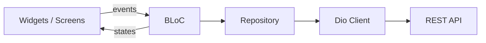

# Blueprint Mobile Flutter

A production-oriented **Flutter mobile blueprint** from **Mikhael Suryawan Putra**. It is a starter application for building handheld / employee-facing apps with authentication, profile management, Firebase integration, push notifications, analytics, crash reporting, and an AI chat surface powered by **Google AI (Gemini)** via `googleai_dart`.

**Package name:** `blueprint_mobile_flutter`  
**Android application ID:** `id.wit.blueprint_mobile_flutter` (debug uses suffix `.dev`)

---

## Features

- **Auth:** Splash, onboarding, login, sign-up, change password, token refresh with automatic retry on `401` (`AuthInterceptor`).
- **Main shell:** Bottom navigation with **Home**, **My Career**, **AI Chat**, and **Profile** (`MainBody`).
- **Profile:** Update profile and related flows backed by repositories and BLoC.
- **AI Chat:** Dedicated screen using Google AI integration (`googleai_dart`).
- **Theming:** Light/dark mode via `AppThemeNotifier` and persisted preference.
- **i18n:** English and Indonesian (`lib/l10n`, ARB-driven codegen — see `l10n.yaml`).
- **Networking:** Dio with `DioFactory` (timeouts, JSON headers, optional dev logging via `PrettyDioLogger`), centralized `Client` in `lib/utils/services/api/rest_api_service.dart`.
- **Storage:** `shared_preferences` for non-sensitive data, `flutter_secure_storage` for tokens and secrets, optional local SQLite (`sqflite`).
- **Firebase:** Core, Messaging (FCM + background handler), Analytics (default event parameters / traffic type), Remote Config, Crashlytics.
- **Connectivity:** Listens for connectivity changes and can surface an offline dialog (`connectivity_plus`, `internet_connection_checker_plus`).
- **Quality:** `flutter_lints`, `bloc_test`, `mocktail` for tests.

---

## Tech stack

| Area | Choice |
|------|--------|
| UI | Flutter (Material 3–oriented theming), `sizer`, `flutter_svg`, `cached_network_image`, `lottie`, etc. |
| State | **BLoC** (`flutter_bloc`) + **Provider** for theme/locale notifiers |
| Routing | **go_router** with custom animated transitions (`animated_go_route.dart`) |
| HTTP | **Dio** + `pretty_dio_logger` (debug), `auth_interceptor`, `token_manager` |
| Env | **flutter_dotenv** (`.env` at project root, listed in `pubspec.yaml` assets) |

---

## Requirements

Values below reflect **`pubspec.yaml`** and native project settings. Use a **current Flutter stable** that satisfies the Dart SDK constraint.

| Item | Version / note |
|------|----------------|
| **Dart SDK** | `>=2.17.0 <4.0.0` (see `environment` in `pubspec.yaml`) |
| **Flutter** | Use a stable release compatible with the above SDK (e.g. Flutter 3.x with Dart 3.x). This repo has been run successfully on **Flutter 3.41.x / Dart 3.11.x** — run `flutter --version` on your machine to confirm. |
| **Android** | **compileSdk / targetSdk: 36**, Java **17**, Kotlin JVM target **17**, `namespace` / `applicationId` match Firebase (`android/app/build.gradle`). **minSdk** follows Flutter’s default (`flutter.minSdkVersion` in Gradle). |
| **iOS** | Deployment target **15.0** (`IPHONEOS_DEPLOYMENT_TARGET` in `ios/Runner.xcodeproj/project.pbxproj`). |
| **Tooling** | Xcode (macOS for iOS), Android Studio or SDK + emulator/device |

For generic Flutter installation steps, see the official docs: [Install Flutter](https://docs.flutter.dev/get-started/install).

---

## Repository layout (high level)

```
lib/
  main.dart                 # Firebase init, dotenv, flavor, MaterialApp.router
  config/                   # Routes, themes, language
  constants/                # App settings, assets paths, keys
  core/                     # Feature BLoCs, repositories, models (per domain)
  screens/                  # UI screens & bodies
  utils/                    # API client, notifications, remote config, helpers
  widgets/                  # Shared widgets
  l10n/                     # Generated localizations (ARB-based)
  firebase_options.dart     # Generated Firebase options
documents/                  # Extra guides (intro, install, setup, structure, styling)
```

Routing constants live in `lib/config/routes/routes.dart`; the **GoRouter** graph is in `lib/config/routes/go_route_generator.dart`.

---

## Getting started

1. **Clone** this repository.

2. **Install dependencies**

   ```bash
   flutter pub get
   ```

3. **Environment file**

   Create a **`.env`** file in the project root (it must not be committed with secrets). It is loaded at startup (`await dotenv.load()`) and referenced in `lib/constants/app_settings.dart`.

   Include at least the variables used by **`AppFlavor`** (development vs production):

   | Variable group | Purpose |
   |----------------|---------|
   | `APP_NAME_DEVELOPMENT` / `APP_NAME_PRODUCTION` | Window title / branding |
   | `API_BASE_URL_DEVELOPMENT` / `API_BASE_URL_PRODUCTION` | REST API host |
   | `API_PORT_DEVELOPMENT` / `API_PORT_PRODUCTION` | Port when `IS_USE_PORT_*` is enabled |
   | `TRAFFIC_TYPE_DEVELOPMENT` / `TRAFFIC_TYPE_PRODUCTION` | Passed to Firebase Analytics default parameters |
   | `AUTH_APP_NAME_DEVELOPMENT` / `AUTH_APP_NAME_PRODUCTION` | App identifier for auth flows |
   | `AUTH_APP_KEY_DEVELOPMENT` / `AUTH_APP_KEY_PRODUCTION` | App key for auth flows |
   | `IS_USE_PORT_DEVELOPMENT` / `IS_USE_PORT_PRODUCTION` | e.g. `"1"` to append `:$port` to base URL, otherwise base URL only |

   Flavor selection in `lib/main.dart`:

   - **Development** settings when **not** in release mode (`kReleaseMode == false`).
   - **Production** settings in **release** builds.

4. **Firebase**

   - Place **`google-services.json`** (Android) and **`GoogleService-Info.plist`** (iOS) as required by your Firebase project.
   - Regenerate **`lib/firebase_options.dart`** if you change Firebase apps (e.g. `flutterfire configure`).

   Firebase is initialized in `main()` with app name **`WITAttendance`** — align this with your Firebase console setup if you rename the project.

5. **Android release signing (optional)**

   Release builds reference `key.properties` and a keystore (see `android/app/build.gradle`). Create these locally for store uploads; they are not part of the public blueprint.

6. **Run**

   ```bash
   flutter run
   ```

   For a release-mode smoke test (production flavor + minification):

   ```bash
   flutter run --release
   ```

7. **Static analysis**

   ```bash
   flutter analyze
   ```

---

## Architecture notes

- **BLoC** separates UI (`screens/`) from business logic (`core/*/bloc`).
- **Repositories** under `core/*/repository` call **`Client.init`**, **`Client.initWithToken`**, or **`Client.initWithRefreshToken`** from `rest_api_service.dart` for HTTP.
- **Dio** instances are created via **`DioFactory`** (`lib/utils/services/api/dio_factory.dart`): shared TLS setup, base URL resolution (`IS_USE_PORT`), timeouts, and debug logging.



---

## Routing (go_router)

Main routes (see `routes.dart` / `go_route_generator.dart`):

| Path | Screen |
|------|--------|
| `/` | Splash |
| `/on-boarding` | Onboarding |
| `/login` | Login |
| `/sign-up` | Sign up |
| `/main` | Main shell (optional `ArgumentsMain` via `extra` or query params) |
| `/theme` | Theme / appearance |
| `/update-profile` | Update profile |
| `/change-password` | Change password |
| `/my-career` | My career |
| `/button` | Button showcase / samples |
| `/ai-chat` | AI chat |
| `/not-found` | Not found |

`GoRouter` extras include **`GoRouterExtension`** helpers on `BuildContext`: `goTo`, `pushTo`, `popRoute`, `replaceTo`.

---

## Localization

- Source strings: `lib/l10n/*.arb`
- Config: `l10n.yaml` (template `app_en.arb`)
- Generated: `flutter gen-l10n` (or happens via `flutter pub get` when `generate: true` in `pubspec.yaml`)

Supported locales in `main.dart`: **en**, **id**.

---

## Additional documentation

| Document | Content |
|----------|---------|
| `documents/0_intro.md` | High-level intro |
| `documents/1_installation.md` | Flutter installation links |
| `documents/2_setup_project.md` | Package rename, bundle ID notes |
| `documents/3_structure.md` | Structure notes |
| `documents/4_styling.md` | Styling notes |

---

## Dependencies

Primary packages from **`pubspec.yaml`** (run `flutter pub outdated` for upgrades):

**Core:** `flutter_bloc`, `provider`, `equatable`, `dio`, `pretty_dio_logger`, `go_router`

**Storage & config:** `shared_preferences`, `flutter_secure_storage`, `flutter_dotenv`, `sqflite`

**Firebase:** `firebase_core`, `firebase_messaging`, `firebase_analytics`, `firebase_remote_config`, `firebase_crashlytics`

**UI & media:** `sizer`, `flutter_svg`, `cached_network_image`, `shimmer`, `loading_animations`, `loading_animation_widget`, `lottie`, `flutter_animate`, `google_fonts`, `smooth_page_indicator`, `animated_bottom_navigation_bar`, `flutter_switch`, `delightful_toast`, `fluttertoast`, `photo_view`, `image_preview`, `timelines_plus`, `flutter_staggered_grid_view`, `image_picker`, `flutter_image_compress`

**Platform & utilities:** `intl`, `pull_to_refresh_flutter3`, `connectivity_plus`, `internet_connection_checker`, `internet_connection_checker_plus`, `package_info_plus`, `store_redirect`, `flutter_local_notifications`, `platform_device_id_plus`, `device_preview`, `get_ip_address`, `email_validator`, `googleai_dart`

**Dev:** `flutter_test`, `bloc_test`, `mocktail`, `flutter_lints`, `flutter_launcher_icons`

**Launcher icons:** configured under `flutter_icons` in `pubspec.yaml`; image paths under `flutter_icons/`.

---

## License

© 2026 [WIT.ID](https://wit.id/)
