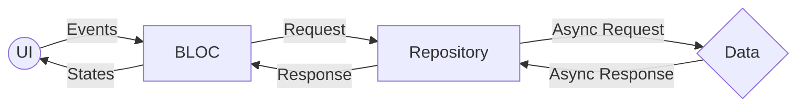

# Inroduction
Flutter is an open source framework by Google for building beautiful, natively compiled, multi-platform applications from a single codebase.

## What is Flutter?      
Flutter is Google’s portable UI toolkit for crafting beautiful, natively compiled applications for mobile, web, and desktop from a single codebase. Flutter works with existing code, is used by developers and organizations around the world, and is free and open source.

## DIO
DIO is a networking library developed by Flutter China. It is powerful Http client for Dart, which supports Interceptors, Global configuration, FormData, Request Cancellation, File downloading, ConnectionTimeout etc. Things that dio supports can be done with normal http library which we get in flutter sdk too but its not that easy to learn or understand so dio can be better.

## BLOC Pattern      
Bloc is a design pattern created by Google to help separate business logic from the presentation layer and enable a developer to reuse code more efficiently

