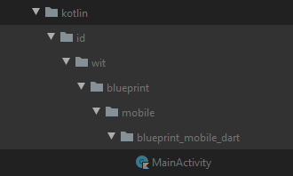

# Setup Project
just clone this repository to create new project. And follow this step to setup new environment. The step is :

## Change Package Name
### For Android
Change the package name in your `AndroidManifest.xml` (in 3 of them, folders: main, debug and profile, according what environment you want to deploy) file:
```dart
<manifest xmlns:android="http://schemas.android.com/apk/res/android"
    package="your.package.name">
```
Also in your `build.gradle` file inside app folder
```dart
defaultConfig {
	applicationId "your.package.name"
	minSdkVersion 21
	targetSdkVersion 31
	versionCode flutterVersionCode.toInteger()
	versionName flutterVersionName
}
```
Finally, change the package in your `MainActivity.kt` class (if the `MainActivity.kt` is not available, check the `MainActivity.java`)
```dart
package "your.package.name"

import io.flutter.embedding.android.FlutterActivity

class MainActivity: FlutterActivity() {
}
```
Change the directory name:



From:

```dart
  android\app\src\main\kotlin\id\wit\blueprint\mobile\blueprint_mobile_flutter
```

To:

```dart
  android\app\src\main\kotlin\your\package\name
```

### For iOS
Change the bundle identifier from your `Info.plist` file inside your `ios/Runner` directory.
```dart
<key>CFBundleIdentifier</key>
<string>com.your.packagename</string>
```