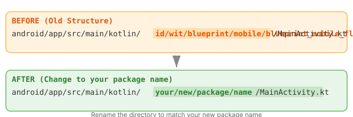

# Setup Project

This guide explains how to take **Blueprint Mobile Flutter** and turn it into your own project with a custom package name, app name, icons, and branding.

> **Important:** Do these steps in order. Skipping around can cause consistency issues between Android and iOS settings.

---

## 1. Change the Project Name

The Flutter project name determines the Dart package name and default directories.

**Manually update `pubspec.yaml`:**

```yaml
name: your_project_name
description: Your app description.
```

Then update imports throughout the codebase from `package:blueprint_mobile_flutter/...` to `package:your_project_name/...`.

**Alternatively, recreate the project structure:**

```bash
# In the project root (will regenerate .dart_tool, .idea, etc.)
flutter create --project-name your_project_name .
```

This reinitializes the project structure while preserving your `lib/`, `test/`, and `assets/` directories.

---

## 2. Change Package Name (Android)

The Android package name (application ID) is used for Google Play, Firebase, and deep links.

### a) `AndroidManifest.xml`

Edit **all three** manifest files:

| File | Path |
|------|------|
| Main | `android/app/src/main/AndroidManifest.xml` |
| Debug | `android/app/src/debug/AndroidManifest.xml` |
| Profile | `android/app/src/profile/AndroidManifest.xml` |

Change the `package` attribute:

```xml
<manifest xmlns:android="http://schemas.android.com/apk/res/android"
    package="your.new.package.name">
```

### b) `build.gradle` (app level)

At `android/app/build.gradle`:

```gradle
android {
    namespace "your.new.package.name"
    defaultConfig {
        applicationId "your.new.package.name"
        ...
    }
}
```

> In modern Flutter, `namespace` is required in `build.gradle.kts` if you're using the Kotlin DSL version. Keep `applicationId` and `namespace` in sync.

### c) `MainActivity.kt`

Rename the directory or create a new file:

```
Old: android/app/src/main/kotlin/id/wit/blueprint/mobile/blueprint_mobile_flutter/MainActivity.kt
New: android/app/src/main/kotlin/your/new/package/name/MainActivity.kt
```



Update the package declaration inside the file:

```kotlin
package your.new.package.name

import io.flutter.embedding.android.FlutterActivity

class MainActivity: FlutterActivity()
```

Make sure the directory tree matches the package name (e.g., `your/new/package/name/`).

---

## 3. Change Bundle ID (iOS)

Open `ios/Runner.xcodeproj/project.pbxproj` or use Xcode:

1. Open the project in Xcode: open `ios/Runner.xcworkspace`
2. Select the **Runner** target → **General** tab
3. Change **Bundle Identifier** from `id.wit.blueprintMobileDart` to `com.yourcompany.yourapp`
4. Also update the **Debug** and **Profile** configurations if they have separate bundle IDs

Alternatively, search and replace in `project.pbxproj`:

```text
PRODUCT_BUNDLE_IDENTIFIER = id.wit.blueprintMobileDart;
→
PRODUCT_BUNDLE_IDENTIFIER = com.yourcompany.yourapp;
```

---

## 4. Update Firebase

After changing package name / bundle ID:

1. **Firebase Console** → Project Settings → Add an app (or update existing)
2. Download the new `google-services.json` (Android) and `GoogleService-Info.plist` (iOS)
3. Replace the old files in `android/app/` and `ios/Runner/`
4. Regenerate `lib/firebase_options.dart`:

```bash
flutterfire configure --project=your-firebase-project-id
```

---

## 5. Update App Name

### Android

In `android/app/src/main/AndroidManifest.xml`:

```xml
<application
    android:label="Your App Name"
    ...>
```

Also update in `AndroidManifest.xml` for `debug` and `profile` variants if they have custom labels.

### iOS

In `ios/Runner/Info.plist`:

```xml
<key>CFBundleName</key>
<string>Your App Name</string>
<key>CFBundleDisplayName</key>
<string>Your App</string>
```

---

## 6. Update Environment Variables

Edit `.env` to match your new app:

```env
APP_NAME_DEVELOPMENT=YourApp Dev
APP_NAME_PRODUCTION=YourApp
AUTH_APP_NAME_DEVELOPMENT=yourapp
AUTH_APP_NAME_PRODUCTION=yourapp
AUTH_APP_KEY_DEVELOPMENT=your-dev-key
AUTH_APP_KEY_PRODUCTION=your-prod-key
```

---

## 7. Regenerate App Launcher Icons

Replace the source icons in `flutter_icons/` directory with your own:

- `flutter_icons/appstore.png` — 1024×1024
- `flutter_icons/playstore.png` — 512×512

Then run:

```bash
flutter pub run flutter_launcher_icons
```

This generates all required icon sizes for Android and iOS based on the `flutter_launcher_icons` config in `pubspec.yaml`.

---

## 8. Update Deep Links (Optional)

If your app uses deep links:

### Android

In `android/app/src/main/AndroidManifest.xml`, update the intent filter:

```xml
<intent-filter android:autoVerify="true">
    <action android:name="android.intent.action.VIEW" />
    <category android:name="android.intent.category.DEFAULT" />
    <category android:name="android.intent.category.BROWSABLE" />
    <data android:scheme="https" android:host="yourdomain.com" />
</intent-filter>
```

### iOS

In Xcode → Runner target → **Signing & Capabilities** → Add **Associated Domains**:

```
applinks:yourdomain.com
```

---

## 9. Update AGENTS.md (for Codex/Claude users)

If you're using Codex CLI or Claude Code, update `AGENTS.md` with your new package name, bundle IDs, and Firebase project ID.

---

## Quick Checklist

| Item | Files to Update |
|------|----------------|
| Project name | `pubspec.yaml` |
| Package name | Android: `build.gradle`, `AndroidManifest.xml` (×3), `MainActivity.kt` + directory |
| Bundle ID | iOS: `project.pbxproj` (or Xcode UI) |
| Firebase config | `google-services.json`, `GoogleService-Info.plist`, `firebase_options.dart` |
| App display name | Android: `AndroidManifest.xml` — iOS: `Info.plist` |
| App icon | `flutter_icons/` images → run `flutter_launcher_icons` |
| .env | All environment variables |
| AGENTS.md | Package name, bundle IDs |
